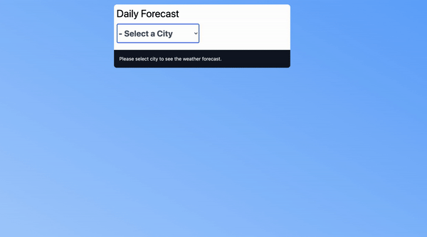

## Table of contents
* [General info](#general-info)
* [Technologies](#technologies)
* [Setup](#setup)
* [Usage](#usage)


## General info
This is application build for weather forecast using  [openweathermap](https://openweathermap.org/) api. It display the next 15 hours weather forecast since the next 5 days is need to have an paid account.

##### How I build the porject
Using laravel, I created a endpoint for getting the weather forecast using openweathermap, then on react I called the  endpoint get forecast from laravel using axios. 
	
## Technologies
Project is created with:
* Laravel 8
* React
* Tailwind CSS
* Composer
* Node 12.3
	
## Setup
Before jumping in, you'll want to make sure you have the system requirements met:
- PHP ([Installation Guide](https://www.php.net/manual/en/install.php))
- Composer ([Installation Guide](https://getcomposer.org/doc/00-intro.md))
- Laravel ([Installation Guide](https://laravel.com/docs/8))
- Node v12.3

To clone the project:
```bash
$ git clone git@github.com:melmagaling/weather-forecast.git
$ cd ../weather-forecast
```
To install PHP dependancies:

```bash
composer install
```
And JS dependancies:
```bash
npm install
```
To test on a BigCommerce store, you can create a free trial on bigcommerce.com or request a free sandbox store by [signing up to be a tech partner](https://www.bigcommerce.com/partners/).

## Usage
To compile JS assets:
```bash
npm run dev
```
To compile the components then watch the files and recompile when one of them changes
```bash
npm run watch
```
To launch the project on your local
```bash
php artisan serve
Starting Laravel development server: http://127.0.0.1:8000
```
To run unit testing.
```bash
php artisan test
```


## Table of contents
* [General info](#general-info)
* [How I build the porject](#architecture-info)
* [Technologies](#technologies)
* [Setup](#setup)

## General info
This is application build for weather forecast using  [openweathermap](https://openweathermap.org/) api. It display the next 15 hours weather forecast since the next 5 days is need to have an paid account.

## Architecture
Using laravel, I created a endpoint for getting the weather forecast using openweathermap, then on react I called the  endpoint get forecast from laravel using axios. 
	
## Technologies
Project is created with:
* Laravel 8
* React
* Tailwind CSS
* Composer
* Node 12.3
	
## Setup
Before jumping in, you'll want to make sure you have the system requirements met:
- PHP ([Installation Guide](https://www.php.net/manual/en/install.php))
- Composer ([Installation Guide](https://getcomposer.org/doc/00-intro.md))
- Laravel ([Installation Guide](https://laravel.com/docs/8))
- Node v12.3

To clone the project:
```bash
$ git clone git@github.com:melmagaling/weather-forecast.git
$ cd ../weather-forecast
```
To install PHP dependancies:

```bash
composer install
```
And JS dependancies:
```bash
npm install
```

## Usage
To compile JS assets:
```bash
npm run dev
```
To compile the components then watch the files and recompile when one of them changes
```bash
npm run watch
```
To launch the project on your local
```bash
php artisan serve
Starting Laravel development server: http://127.0.0.1:8000
```
To run unit testing.
```bash
php artisan test
```

To run check weather forecast on console.
php artisan weather:forecast "city name" or "city name, city name"
```bash
php artisan weather:forecast
```